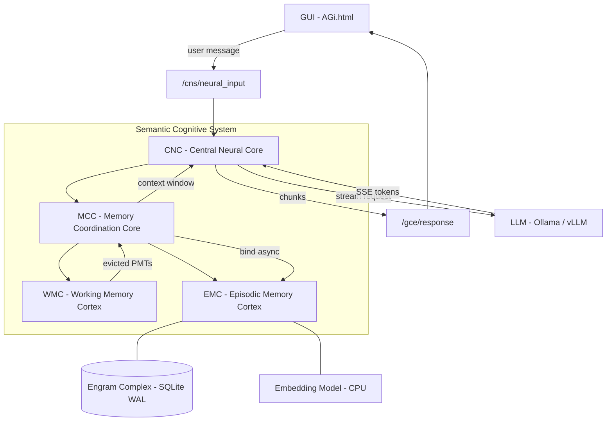
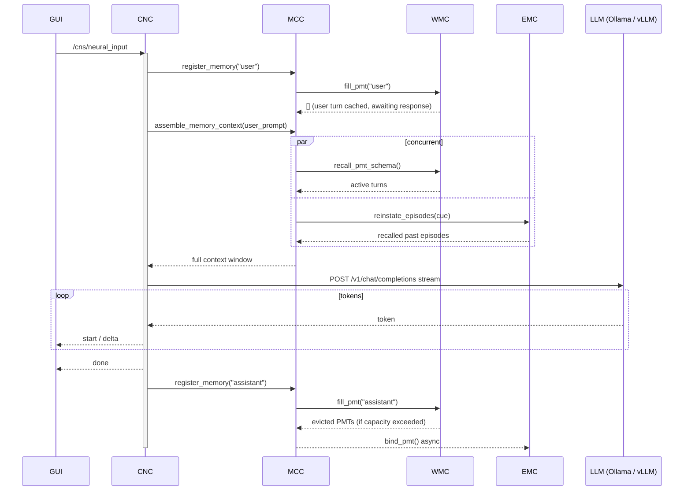

# AGi — Amazing Grace infrastructure
 
**AuRoRA** · Autonomous Robot with Reasoning Architecture  
**Author:** [OppaAI](https://github.com/OppaAI) · Beautiful British Columbia, Canada
 
[](https://github.com/OppaAI/AGi)

[](https://opensource.org/licenses/GPL-3.0)
 


 
For more comprehensive documentation: [](https://deepwiki.com/OppaAI/AGi)
 
---
 
A clean-slate rebuild of my autonomous robot project, starting from first principles.
After building [ERIC](https://github.com/OppaAI/eric) for the NVIDIA Cosmos Cookoff 2026, I learned what I would do differently — proper ROS2 architecture from day one, a biologically-inspired memory system, and a foundation that can grow into full autonomy.
 
The goal: build an autonomous ground robot that can explore nature with me, powered by on-device AI with no cloud dependency.
 
---
 
## Hardware
 
| Component | Model |
|---|---|
| SBC | Jetson Orin Nano Super 8GB |
| Robot | Waveshare UGV Beast (tracked) |
| LiDAR | YDLIDAR D500 360 |
| Depth Camera | OAK-D Lite (stereo + YOLO) |
| Pan-tilt + Webcam | USB |
| Storage | 1TB NVMe |
 
---

## Stack
 
- **Cosmos Reason2 2B** via vLLM — vision + reasoning brain (target: Jetson Orin Nano)
- **ROS2 Humble** — full native architecture from day one
- **BAAI/bge-base-en-v1.5** — CPU-only semantic embeddings (anchor vector filtering + episodic recall)
- **SQLite** — lightweight on-device memory storage
- **rosbridge** — WebSocket bridge to web GUI
- **ephem** — local moon phase calculation (no network)

---
 
## Repository Structure
 
```
AGi/
├── AuRoRA/          # Robot workspace (Jetson Orin Nano)
│   └── src/
│       └── scs/     # Semantic Cognitive System
│           └── scs/
│               ├── cnc.py   # Central Neural Core (ROS2 node)
│               ├── mcc.py   # Memory Coordination Core
│               ├── wmc.py   # Working Memory Cortex
│               ├── emc.py   # Episodic Memory Cortex
│               └── msb.py   # Memory Storage Bank (shared substrate)
│
└── AIVA/            # Server workspace (PC) — future
    └── src/
```
 
---
 
## Roadmap
 
### Phase 1 — Chatbot with Memory
 
| Milestone | Description | Status |
|---|---|---|
| M1 | Chatbot + Working Memory (WMC) + Episodic Memory (EMC) | ✅ Complete |
| M1.5 | Memory bridges + Agentic tool validation | 🟢 In Progress |
| M1.6 | EEE — Emergency and Exception Event module (HRS) | ⬜ Planned |
| M1.X | Side Quests — Voice, Messaging, Web UI | ⬜ Planned |
| M2a | EMC maturity — forgetting + importance scoring | ⬜ Planned |
| M2b | Semantic Memory (SMC) basics — distillation + structure | ⬜ Planned |
| M2c | SMC maturity — graph structure + anchoring + decay | ⬜ Planned |
| M3 | Procedural Memory (PMC) | ⬜ Planned |

### M1 — Chatbot + WMC + EMC
- PMT lifecycle with hybrid chunk/slot eviction (Miller's Law 7±2)
- Async embedding worker via BAAI/bge-base-en-v1.5
- RRF dual-path recall — semantic (sqlite-vec KNN) + lexical (FTS5) fusion
- SQLite WAL episodic storage — no expiry, 1TB NVMe
- Conflict/versioning columns in EMC schema (prep for M2b): `conflict`, `superseded_by`, `valid_from`, `valid_until`
- Importance columns in EMC schema (prep for M2a): `memory_strength`, `last_recalled_at`, `recall_count`, `novelty_score`

### M1.5 — Memory Bridges + Agentic Tool Validation
- Anchor vector PMT filtering — semantic trivial-turn gating (replaces length filter)
- Session-end WMC flush to EMC on `close()` — salience-gated, no silent loss of unsaved turns
- Basic user profile store — `~/.agi/cns/user_profile.json` as lightweight SMC precursor, always injected into context
- Anti-hallucination grounding instruction in `GRACE_SYSTEM_PROMPT` — no invented values for unrecalled episodes
- Recall parameter tuning — validate `RECALL_DEPTH`, `RECALL_SURFACE_LIMIT`, `RELEVANCE_THRESHOLD`, `RECALL_TIMEOUT`
- Episodic scaffold — explicit `EpisodicScaffold` class in `emc.py` owning RECALL_RESERVE trimming and chronological sequencing before context injection
- Chunk budget enforcement — `ChunkEstimator` in `msb.py` shared across WMC, EMC, MCC; enforces `RECALL_RESERVE` and `CORTICAL_CAPACITY`
- Tokenizer-accurate chunk counting — `ChunkEstimator` loads real model tokenizer; graceful fallback to char-division if unavailable
- Agentic tools module (`tools/`):
    - Weather — MSC GeoMet (Environment Canada), no API key, BC-optimised
    - Moon phase — `ephem` local calculation, no network dependency
    - Aurora forecast — NOAA SWPC Kp index, real-time geomagnetic activity
    - Web search — SearXNG via MCP server
- Unit tests: WMC eviction + EMC recall (RRF, semantic/lexical paths, relevance threshold)
- Integration test gate — 9 criteria must pass before M2a opens

### M1.6 — EEE — Emergency and Exception Event module
- EEE module in HRS — severity-tiered structured event records
- Persistent event log — written to disk, queryable
- Drop-in replacement for logger handle passed to CNC, MCC, WMC, EMC, MSB
- Ring buffer of recent events — feeds Web UI monitoring panel (M1.X-d)
- Emergency handling — graceful degradation and shutdown triggers on critical events

### M1.X — Side Quests
Side quests between memory milestones — no fixed order, picked up when ready. M1.X closes when M2a opens.

- **M1.X-a** TTS Robot — evaluate Piper vs Kokoro for on-device CPU streaming; integrate selected engine into Grace's response pipeline
- **M1.X-b** ASR — FasterWhisper on-device speech to text; microphone input pipeline into CNC; VAD gating
- **M1.X-c** Messaging — Telegram (bot API, proven from previous projects), Discord, Gmail; unified input into CNC neural input
- **M1.X-d** Web UI + TTS Web — sophisticated monitoring UI (cognitive state, memory panels, real-time WMC/EMC visualization, robot controls); browser TTS audio playback

### M2a — EMC Maturity
- 3-dimension importance scoring: SMC similarity, novelty score, content signals
- Ebbinghaus forgetting curve: `R = e^(−t/S)`, S set by importance score
- Duplicate/similarity clustering — cosine > 0.85 = merge candidates
- Daily reflection (11pm) — R calculation, deduplication, low-salience deletion
- Weekly deep sweep via Cosmos — full importance rescore, conflict resolution, health report
- Memory dumps to `~/.aurora/memory_dumps/daily/` and `weekly/`

### M2b — SMC Basics
- Distillation pipeline — EMC episodes → Cosmos → SMC facts
- 11pm nightly reflection — novel vs routine day detection
- Recursive summary update: `Mi = LLM(Hi, Mi-1)`
- SMC fact versioning — `valid_from`, `valid_until`, `superseded_by`
- Conflict detection during conversation — GRACE asks to clarify
- SMC feeds back into WMC context injection via MCC

### M2c — SMC Maturity
- SMC as knowledge graph — entities + relationships + triples
- SMC anchors EMC importance scoring (personal facts never decay)
- Cross-layer search — query spans WMC + EMC + SMC simultaneously
- Dynamic WMC capacity via HRS reading VCS vitals

### M3 — Procedural Memory (PMC)
- YAML-based skill storage
- Skill ingestion pipeline
- Sandboxed skill execution
- PMC + SMC interaction design

---
 
## Phase 2 — Voice
 
| Milestone | Description | Status |
|---|---|---|
| M4 | TTS on robot — Piper / Kokoro CPU streaming | → M1.X-a |
| M5 | TTS in web GUI — browser audio playback | → M1.X-d |

### M4 — TTS on Robot
→ Promoted to M1.X-a. See Side Quests.

### M5 — TTS in Web GUI
→ Promoted to M1.X-d. See Side Quests.

---
 
## Phase 3 — Multimodal + Knowledge
 
| Milestone | Description | Status |
|---|---|---|
| M6 | Image input — camera + Cosmos vision | ⬜ Planned |
| M7 | ASR — on-device speech to text | → M1.X-b |
| M8 | Knowledge ingestion — RAG + PDF/docs | ⬜ Planned |
| M9 | Agentic web search + crawling | ⬜ Planned |
| M10 | Messaging — Telegram, Discord, Gmail | → M1.X-c |
 
### M6 — Image Input + Visuospatial Memory
- OAK-D frames → Cosmos Vision → text description → visuospatial PMT
- WMC visuospatial sketchpad slot (Cowan 4±1)
- Episodic buffer integrating phonological + visuospatial PMTs

### M7 — ASR
→ Promoted to M1.X-b. See Side Quests.

### M8 — Knowledge Ingestion (RAG)
- Passive RAG — PDF/doc → embeddinggemma → SMC directly
- Conflict report UI for ingested knowledge
- Ingestion conflict resolution workflow

### M9 — Agentic Web Search
- AIVA LLM as web agent
- Active RAG — search → summarise → SMC
- Multiple search combining semantic + keyword + SQL

### M10 — Messaging
→ Promoted to M1.X-c. Updated scope: Telegram, Discord, Gmail (Slack removed). See Side Quests.

---
 
## Phase 4 — Hardware + Autonomy
 
| Milestone | Description | Status |
|---|---|---|
| M11 | Motors + LiDAR + OAK-D integration | ⬜ Planned |
| M12 | Navigation + SLAM | ⬜ Planned |
| M13 | Agentic mission execution | ⬜ Planned |
 
### M11 — Motors + Sensors
- LiDAR → text description → visuospatial PMT
- OAK-D depth + object detection integration
- Sensor fusion into episodic buffer

### M12 — Navigation + SLAM
- Nav2 + Isaac ROS
- Spatial memory in SMC — home layout, familiar routes

### M13 — Agentic Mission Execution
- Mission planning via PMC skills
- Igniter node for ordered startup and health checks

---
 
## Phase 5 — Deep Learning
 
| Milestone | Description | Status |
|---|---|---|
| M14 | Graph-RAG — SMC as knowledge graph | ⬜ Planned |
| M15 | LoRA fine-tuning — permanent learning | ⬜ Planned |
| M16 | Test-time training — self-evolution | ⬜ Planned |
 
### M14 — Graph-RAG
- SMC as full knowledge graph — entities + relationships
- Tree-based hierarchical search (HAT) for large SMC
- Multiple search strategies combined

### M15 — LoRA Fine-tuning
- Bake frequently accessed SMC knowledge into Cosmos weights
- GRACE learns permanently, not just retrieves

### M16 — Test-Time Training
- Adapt Cosmos weights during inference from new context
- Self-evolution milestone

---
 
## Cognitive Development Phases
 
| Phase | Capability | Milestone |
|---|---|---|
| Phase 1 — Memory | "I can remember" | M1 WMC + EMC |
| Phase 2 — Salience | "I know what matters" | M2a EMC maturity |
| Phase 3 — Cognition | "I have inner state" | M2b SMC + reflection |
| Phase 4 — Consciousness | "I continuously exist" | M5+ global workspace |
 
---
 
## Architecture
 

 
---
 
## Conversation Sequence
 

 
---
 
## Quick Start
 
```bash
# 1. Clone
git clone https://github.com/OppaAI/AGi ~/AGi
cd ~/AGi/AuRoRA
 
# 2. Install deps
rosdep install --from-paths src --ignore-src -r -y
pip3 install -r requirements.txt --break-system-packages
 
# 3. Build
colcon build --packages-select scs
source install/setup.bash
 
# 4. Start LLM inference
# Option A — Ollama (recommended for development)
ollama serve                          # on inference PC
# set VLLM_BASE_URL = "http://<pc-ip>:11434" in cnc.py
 
# Option B — vLLM / Cosmos (Jetson target)
bash launch/cosmos.sh
# Wait ~3 min for: Application startup complete
 
# 5. Start GRACE
ros2 run scs cnc
 
# 6. Start rosbridge
ros2 launch rosbridge_server rosbridge_websocket_launch.xml
 
# 7. Open GUI
python3 -m http.server 9413 --directory src/scs/scs
# Open: http://<jetson-ip>:9413/AGi.html
```
 
---
 
## Built by
 
Solo developer — Beautiful British Columbia, Canada. No CS/ML degree.  
Just curiosity, a tracked robot, and a Jetson Orin Nano.
 
Previous project: [ERIC — Edge Robotics Innovation by Cosmos](https://github.com/OppaAI/eric)  
Built for the NVIDIA Cosmos Cookoff 2026.
