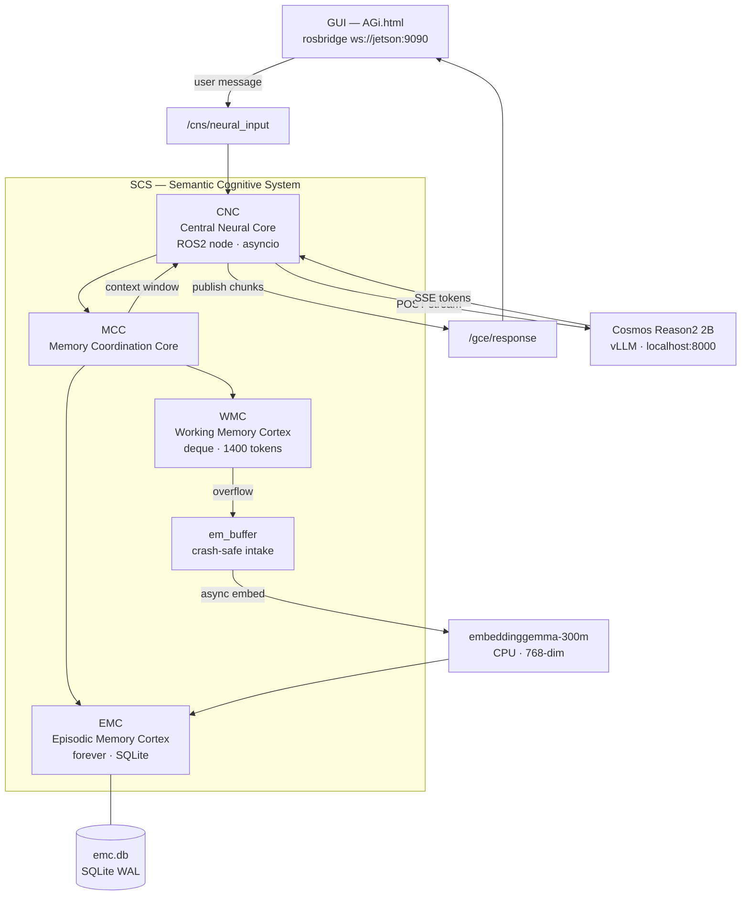
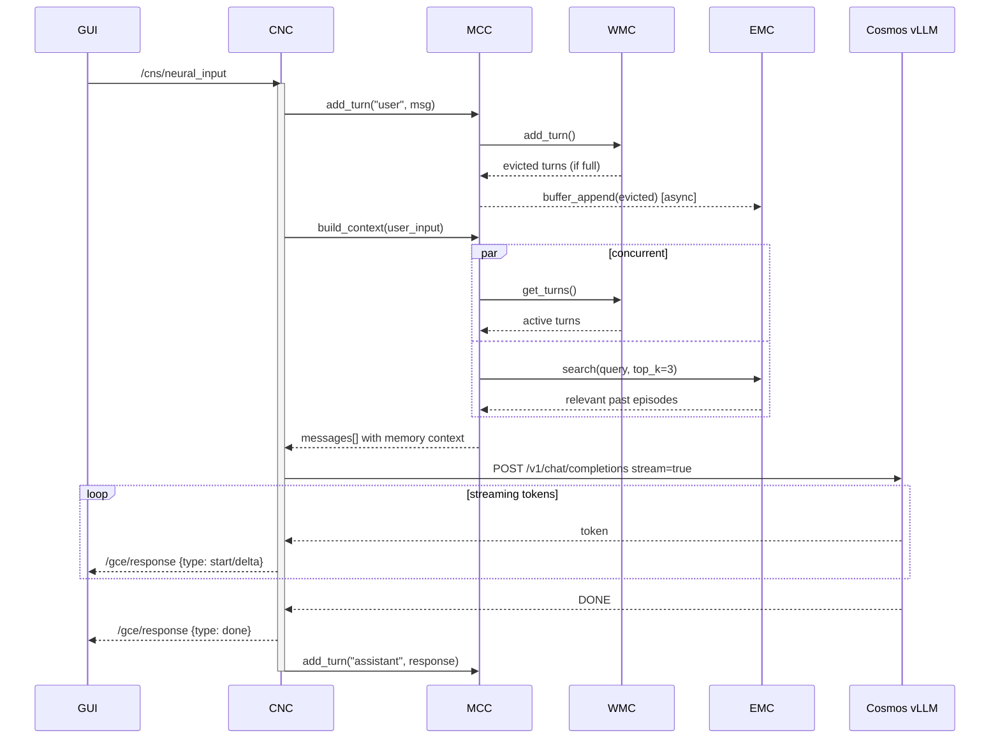

# AGi — Autonomous General Intelligence

**AuRoRA** · Autonomous Robot with Reasoning Architecture  
**Author:** [OppaAI](https://github.com/OppaAI) · Beautiful British Columbia, Canada  
**License:** GPL-3.0-only

---

A clean-slate rebuild of my autonomous robot project, starting from first principles.  
After building [ERIC](https://github.com/OppaAI/eric) for the NVIDIA Cosmos Cookoff 2026, I learned what I would do differently — proper ROS2 architecture from day one, a biologically-inspired memory system, and a foundation that can grow into full autonomy.

The goal: build an autonomous ground robot that can explore nature with me, powered by on-device AI with no cloud dependency.

---

## Hardware

| Component | Model |
|---|---|
| SBC | Jetson Orin Nano Super 8GB |
| Robot | Waveshare UGV Beast (tracked) |
| LiDAR | YDLIDAR D500 360° |
| Depth Camera | OAK-D Lite (stereo + YOLO) |
| Pan-tilt + Webcam | USB |
| Storage | 1TB NVMe |

---

## Stack

- **Cosmos Reason2 2B** via vLLM — vision + reasoning brain
- **ROS2 Humble** — full native architecture from day one
- **embeddinggemma-300m** — CPU-only semantic embeddings
- **SQLite** — lightweight on-device memory storage
- **rosbridge** — WebSocket bridge to web GUI

---

## Repository Structure

```
AGi/
├── AuRoRA/          # Robot workspace (Jetson Orin Nano)
│   └── src/
│       └── scs/     # Semantic Cognitive System
│           └── scs/
│               ├── cnc.py   # Central Neural Core (ROS2 node)
│               ├── mcc.py   # Memory Coordination Core
│               ├── wmc.py   # Working Memory Cortex
│               └── emc.py   # Episodic Memory Cortex
│
└── AIVA/            # Server workspace (PC) — future
    └── src/
```

---

## Roadmap

### Phase 1 — Chatbot with Memory
| Milestone | Description | Status |
|---|---|---|
| M1 | Chatbot + Working Memory (WMC) + Episodic Memory (EMC) | 🟢 In Progress |
| M2 | + Semantic Memory (SMC) + 11pm daily reflection | ⬜ Planned |
| M3 | + Procedural Memory (PMC) | ⬜ Planned |

### Phase 2 — Hardware / Autonomy
| Milestone | Description | Status |
|---|---|---|
| M4 | Motors + LiDAR + OAK-D integration | ⬜ Planned |
| M5 | Navigation + SLAM | ⬜ Planned |
| M6 | Agentic mission execution | ⬜ Planned |

---

## Memory Architecture

GRACE's memory is modelled on the human brain — four cortices, each serving a distinct role, coordinated by the MCC.



---

## Conversation Sequence

A single conversation turn — from user input to GRACE's response.



---

## Quick Start

```bash
# 1. Clone
git clone https://github.com/OppaAI/AGi ~/AGi
cd ~/AGi/AuRoRA

# 2. Install deps
rosdep install --from-paths src --ignore-src -r -y
pip3 install httpx sentence-transformers Pillow "numpy<2" --break-system-packages

# 3. Build
colcon build --packages-select scs
source install/setup.bash

# 4. Start Cosmos vLLM
bash launch/cosmos.sh
# Wait ~3 minutes for: "Application startup complete"

# 5. Start GRACE
ros2 run scs cnc

# 6. Start rosbridge
ros2 launch rosbridge_server rosbridge_websocket_launch.xml

# 7. Open GUI
# Serve AGi.html from Jetson:
python3 -m http.server 9413 --directory src/scs/scs
# Open in browser: http://<jetson-ip>:9413/AGi.html
```

---

## Built by

Solo developer — Beautiful British Columbia, Canada. No CS/ML degree.  
Just curiosity, a tracked robot, and NVIDIA Cosmos Reason 2 on a Jetson.

Previous project: [ERIC — Edge Robotics Innovation by Cosmos](https://github.com/OppaAI/eric)  
Built for the NVIDIA Cosmos Cookoff 2026.
