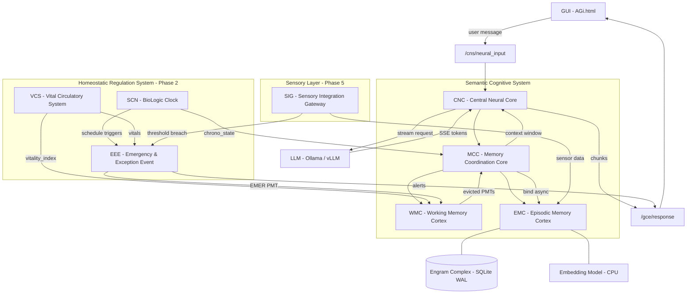
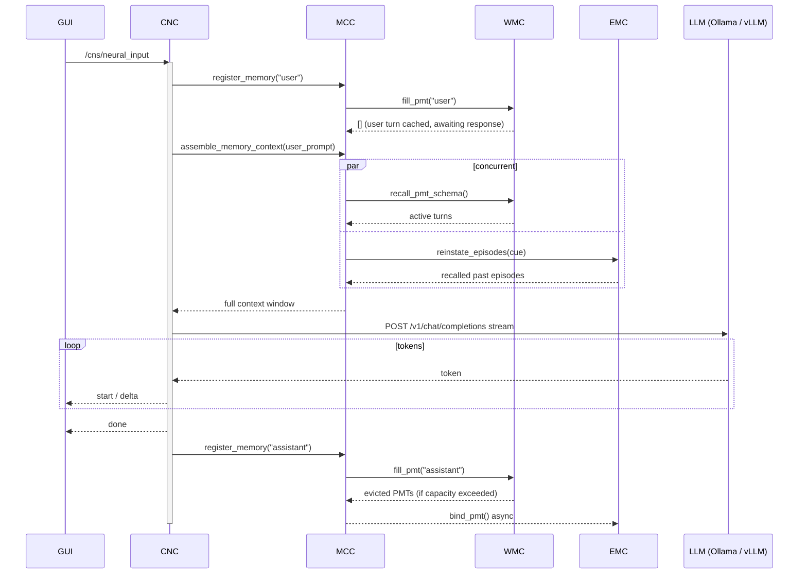

# AGi — Amazing Grace infrastructure
 
**AuRoRA** · Autonomous Robot with Reasoning Architecture  
**Author:** [OppaAI](https://github.com/OppaAI) · Beautiful British Columbia, Canada
 
[](https://github.com/OppaAI/AGi)

[](https://opensource.org/licenses/GPL-3.0)
 


 
For more comprehensive documentation: [](https://deepwiki.com/OppaAI/AGi)
 
---
 
A clean-slate rebuild of my autonomous robot project, starting from first principles.
After building [ERIC](https://github.com/OppaAI/eric) for the NVIDIA Cosmos Cookoff 2026, I learned what I would do differently — proper ROS2 architecture from day one, a biologically-inspired memory system, and a foundation that can grow into full autonomy.
 
The goal: build an autonomous ground robot that can explore nature with me, powered by on-device AI with no cloud dependency.
 
---
 
## Hardware
 
| Component | Model |
|---|---|
| SBC | Jetson Orin Nano Super 8GB |
| Robot | Waveshare UGV Beast (tracked) |
| LiDAR | YDLIDAR D500 360 |
| Depth Camera | OAK-D Lite (stereo + YOLO) |
| Pan-tilt + Webcam | USB |
| Storage | 1TB NVMe |
 
---
 
## Stack
 
- **Cosmos Reason2 2B** via vLLM — vision + reasoning brain (target: Jetson Orin Nano)
- **ROS2 Humble** — full native architecture from day one
- **BAAI/bge-base-en-v1.5** — CPU-only semantic embeddings (anchor vector filtering + episodic recall)
- **SQLite** — lightweight on-device memory storage
- **rosbridge** — WebSocket bridge to web GUI
- **ephem** — local moon phase calculation (no network)
---
 
## Repository Structure
 
```
AGi/
├── AuRoRA/          # Robot workspace (Jetson Orin Nano)
│   └── src/
│       └── scs/     # Semantic Cognitive System
│           └── scs/
│               ├── cnc.py   # Central Neural Core (ROS2 node)
│               ├── mcc.py   # Memory Coordination Core
│               ├── wmc.py   # Working Memory Cortex
│               ├── emc.py   # Episodic Memory Cortex
│               └── msb.py   # Memory Storage Bank (shared substrate)
│
└── AIVA/            # Server workspace (PC) — future
    └── src/
```
 
---
 
## CNS Module Reference
 
| Acronym | Name | Biological Analogue | Function |
|---|---|---|---|
| CNC | Central Neural Core | Prefrontal Cortex | Orchestration, LLM interface, response streaming |
| MCC | Memory Coordination Core | Hippocampal Hub | Context assembly, memory routing |
| WMC | Working Memory Cortex | Phonological Loop | Active PMT management, Miller's Law eviction |
| EMC | Episodic Memory Cortex | Hippocampus | Long-term episodic storage and recall |
| MSB | Memory Storage Bank | Synaptic Substrate | Shared SQLite layer, vector math, RRF fusion |
| PMC | Procedural Memory Cortex | Cerebellum | Skill storage, scheduled intents, task execution |
| SMC | Semantic Memory Cortex | Neocortex | Structured knowledge, facts, graph relationships |
| SCN | BioLogic Clock | Circadian Pacemaker | Unifies time, circadian rhythms, scheduled events (HRS) |
| EEE | Emergency & Exception Event | Amygdala | Pain, urgency, reflexes — replaces standard logger (HRS) |
| VCS | Vital Circulatory System | Autonomic Nervous System | Heartbeat, power, thermals, health monitoring (HRS) |
| SIG | Sensory Integration Gateway | Thalamus | Filters noise, routes sensor data, geo-tags memories (Phase 5) |
 
---
 
## Roadmap
 
---
 
### Phase 1 — Chatbot with Memory
 
| Milestone | Description | Status |
|---|---|---|
| M1 | Chatbot + Working Memory (WMC) + Episodic Memory (EMC) | ✅ Complete |
| M1.5 | Memory bridges + Agentic tool validation | 🟢 In Progress |
| M1.6 | Config refactor + BioLogic Clock (SCN) | ⬜ Planned |
| M1.X | Side Quests — Voice, Messaging, Web UI | ⬜ Planned |
| M2a | EMC maturity — forgetting + importance scoring | ⬜ Planned |
| M2b | Semantic Memory (SMC) basics — distillation + structure | ⬜ Planned |
| M2c | SMC maturity — graph structure + anchoring + decay | ⬜ Planned |
| M3 | Procedural Memory (PMC) | ⬜ Planned |
 
---
 
### M1 — Chatbot + WMC + EMC
**Goal:** Grace can remember across sessions.
 
- [x] PMT lifecycle with hybrid chunk/slot eviction (Miller's Law 7±2)
- [x] Async embedding worker via BAAI/bge-base-en-v1.5
- [x] Semantic search with RRF fusion (semantic + lexical dual-path)
- [x] SQLite WAL episodic storage — no expiry, 1TB NVMe
- [x] Conflict/versioning columns in EMC schema (prep for M2b): `conflict`, `superseded_by`, `valid_from`, `valid_until`
- [x] Importance columns in EMC schema (prep for M2a): `memory_strength`, `last_recalled_at`, `recall_count`, `novelty_score`
- [x] Register user turn before LLM stream — amnesia fix (`cnc.py`)
- [x] Double user message guard in WMC `_induced_pmt` (`wmc.py`)
- [x] Schema versioning in MSB — `schema_meta` table (`msb.py`)
- [x] Binding stream `maxlen` cap — OOM guard (`emc.py`)
- [x] Trivial PMT length filter at WMC→EMC eviction boundary (`mcc.py`)
---
 
### M1.5 — Memory Bridges + Agentic Tool Validation
**Goal:** Close the gaps M2a assumes exist. Validate agentic pipeline before M2a depends on it.
 
#### Memory Bridges
- [ ] Anchor vector PMT filtering via embeddinggemma — semantic trivial PMT discard at eviction boundary (replaces M1 length filter)
- [ ] Session-end WMC flush to EMC on shutdown — gated on content length threshold
- [ ] Basic user profile store — personal facts always injected into context (lightweight SMC precursor)
- [ ] Anti-hallucination grounding instruction in GRACE system prompt — only reference injected memories
- [ ] Recall tuning validation — verify `RECALL_DEPTH`, `RECALL_SURFACE_LIMIT`, `RELEVANCE_THRESHOLD` under real usage
- [ ] Episodic scaffold — `EpisodicScaffold` class in `emc.py` owning RECALL_RESERVE trimming and chronological sequencing before context injection
- [ ] Chunk budget enforcement — `ChunkEstimator` in `msb.py` shared across WMC, EMC, MCC; enforces `RECALL_RESERVE` and `CORTICAL_CAPACITY`
- [ ] Tokenizer-accurate chunk counting — `ChunkEstimator` loads real model tokenizer; graceful fallback to char-division if unavailable
- [ ] `NeuralTextInput` schema in `scs/types.py` — standardize JSON contract across CLI, web, and voice input sources
- [ ] Multi-user identity — replace hardcoded `"user"` speaker literal with `user_id` from `NeuralTextInput` schema
- [ ] `pack_vector` and `normalize_vector` migration from `msb.py` to `hrs.py` — shared vector math available to all cortices
- [ ] Busy queue — buffer incoming CNC inputs during active processing rather than dropping them
#### Agentic Tools
- [ ] Weather current + forecast — MSC GeoMet (Environment and Climate Change Canada, no API key)
- [ ] Weather history — MSC GeoMet historical data
- [ ] Moon phase + moonrise/moonset — `ephem` local calculation (on-device, no API, no network dependency)
- [ ] Aurora forecast — NOAA SWPC Kp index (`services.swpc.noaa.gov`, free, no key)
- [ ] Verify tool results flow correctly through MCC memory pipeline
- [ ] Validate tool call latency on Jetson Orin Nano
#### Stability
- [ ] WMC unit tests — dual-guard eviction logic
- [ ] EMC unit tests — RRF recall correctness with known episodes
- [ ] Manual integration test suite — document pass criteria for M2a entry
---
 
### M1.6 — Config Refactor + BioLogic Clock
**Goal:** Clean separation of all tuneable parameters into YAML. Grace has a shared sense of time across the whole system.
 
#### Config Refactor
- [ ] Intrinsic parameters YAML — internal cognitive constants (`RECALL_DEPTH`, `CORTICAL_CAPACITY`, `RELEVANCE_THRESHOLD`, Miller's Law slots, etc.)
- [ ] Extrinsic parameters YAML — hardware and environment settings (LLM endpoint, ROS domain, device paths, ports)
- [ ] Persona YAML — Grace's name, personality traits, system prompt fragments, tone modifiers
- [ ] LLM parameters YAML — model name, temperature, max tokens, top_p, stop sequences, stream flag
- [ ] All hardcoded values across CNC, MCC, WMC, EMC, MSB migrated to YAML loaders
- [ ] Hot-reload support — parameter changes apply without full restart where safe
- [ ] Engram gateway path construction moved from `mcc.py` into HRS entity gateway
#### BioLogic Clock (SCN — lives in HRS)
- [ ] `scn.py` in HRS — lightweight biological time daemon
- [ ] Publish `/cns/chrono_state`: unix time, uptime, circadian phase (dawn / active / wind_down / sleep / dream), day progress, fatigue factor, seconds_since_human_contact, next scheduled event
- [ ] Write `/tmp/bio_clock.json` for non-ROS readers (Web UI, agentic tools)
- [ ] Replace all internal ad-hoc timers and sleep loops — whole system shares one time source
- [ ] Circadian phase feeds MCC — modulates Grace's response length and tone (wind_down = shorter, more reflective)
- [ ] Drives 11pm daily reflection and weekly deep sweep trigger timing (M2a)
- [ ] Persists `last_uptime`, `energy_level` across reboots
---
 
### M1.X — Side Quests
**Goal:** Fun capabilities between memory milestones. No fixed order — pick up when ready. M1.X closes when M2a opens.
 
#### M1.X-a — TTS Robot
- [ ] Evaluate Piper vs Kokoro for on-device CPU streaming quality
- [ ] Piper CPU streaming on Jetson — proven, lightweight
- [ ] Kokoro evaluation — newer model, potentially higher quality
- [ ] Selected TTS engine integrated into Grace's response pipeline
#### M1.X-b — ASR
- [ ] FasterWhisper on-device speech to text
- [ ] Microphone input pipeline into CNC
- [ ] Silero VAD to gate transcription — replaces always-on mic
- [ ] Optional wake word trigger (OpenWakeWord or Porcupine)
#### M1.X-c — Messaging
- [ ] Telegram integration — bot API, proven from previous projects
- [ ] Discord integration — bot API
- [ ] Gmail integration — send + receive
- [ ] Unified `BridgeMessage` JSON standard for ROS2 adapters — adding new platforms takes hours not weeks
- [ ] Unified messaging interface into CNC neural input
#### M1.X-d — Web UI + TTS Web
- [ ] Sophisticated monitoring web UI — cognitive state, memory panels, inner monologue, controls
- [ ] Real-time memory visualization — WMC occupancy, EMC stats, active recall
- [ ] Browser TTS audio playback — streams Grace's voice to web client
- [ ] Robot controls and sensor feeds in UI
---
 
### M2a — EMC Maturity
**Goal:** Grace knows what matters and forgets what doesn't.
 
- [ ] Decision: keep async embedding per-segment or move to 11pm batch (based on M1 data)
- [ ] 3-dimension importance scoring:
    - Dimension 1 — SMC similarity (personal fact anchoring)
    - Dimension 2 — novelty score via embeddinggemma (novel = important, duplicate = expendable)
    - Dimension 3 — content signals (length, questions, named entities, significance markers)
- [ ] Ebbinghaus forgetting curve: `R = e^(−t/S)`, S set by importance score, +1 on each recall
- [ ] Duplicate/similarity clustering — cosine > 0.85 = merge candidates
- [ ] Daily reflection (11pm via SCN) — fast sweep:
    - Calculate R for all episodes
    - Cluster and merge duplicates → distil to SMC
    - Delete low importance + high decay episodes
- [ ] Weekly assessment (Sunday via SCN) — deep sweep via Cosmos:
    - Full importance scoring across all EMC
    - Resolve pending conflicts
    - Generate memory health report for OppaAI review
- [ ] Memory dumps to `~/.aurora/memory_dumps/daily/` and `weekly/`
- [ ] Evaluate anchor vector PMT filtering accuracy — upgrade to fine-tuned Qwen3 0.6B if insufficient
- [ ] `_strip_model_artifacts()` in CNC — strip `<think>` blocks and roleplay artifacts from assistant response before MCC registration
- [ ] Salience gate on assistant response at CNC boundary — discard low-salience turns before `register_memory()`
- [ ] `staging_id` integrity check after Dream Cycle consolidation
- [ ] Heartbeat logging during long EMC idle periods
- [ ] Graceful drain + timeout fallback for sharp-wave ripple trigger during `terminate()`
- [ ] Watchdog for theta rhythm during dreaming cycle
---
 
### M2b — SMC Basics
**Goal:** Grace builds structured knowledge from episodic experience.
 
- [ ] SMC structure decision — flat key-value vs triples vs graph
- [ ] Distillation pipeline — EMC episodes → Cosmos → SMC facts
- [ ] 11pm nightly reflection — novel vs routine day detection
- [ ] Recursive summary update: `Mi = LLM(Hi, Mi-1)`
- [ ] SMC fact update — when facts change, old fact versioned not deleted
- [ ] Conflict detection during conversation — GRACE asks to clarify
- [ ] `_pending_conflict` flag in MCC for turn-spanning conflict state
- [ ] Memory versioning — `valid_from`, `valid_until`, `superseded_by`
- [ ] SMC feeds back into WMC context injection via MCC
---
 
### M2c — SMC Maturity
**Goal:** Grace has a structured, anchored, queryable knowledge graph.
 
- [ ] SMC as knowledge graph — entities + relationships + triples
- [ ] SMC anchors EMC importance scoring (personal facts never decay)
- [ ] SMC fact decay — do facts ever expire? policy decision
- [ ] Cross-layer search — query spans WMC + EMC + SMC simultaneously
- [ ] Dynamic WMC capacity — linked to EEE/VCS vitality signals (Phase 2)
- [ ] Fine-tuned Qwen3 0.6B memory gating classifier if embeddinggemma insufficient
---
 
### M3 — Procedural Memory (PMC)
**Goal:** Grace can learn and execute skills.
 
- [ ] YAML-based skill storage
- [ ] Skill ingestion pipeline
- [ ] Sandboxed skill execution
- [ ] PMC + SMC interaction design
- [ ] Evaluate vector backend — if EMC+SMC+PMC combined load exceeds SQLite+DiskANN ceiling, swap `EngramComplex` to Qdrant or pgvector. Cortex logic untouched.
---
 
## Phase 2 — Physiology & Nervous System
 
> **Why after memory:** EEE and VCS are full systems, not side quests. Building them after M2/M3 means the cognitive substrate is stable enough to genuinely benefit from health signals — VCS vitality feeds WMC capacity, SCN phase feeds reflection timing. The BioLogic Clock (SCN) ships early in M1.6 as a lightweight stub; EEE and VCS wait until they can be built properly.
 
| Milestone | Description | Status |
|---|---|---|
| P2-M1 | EEE — Emergency & Exception Event (Amygdala) | ⬜ Planned |
| P2-M2 | VCS — Vital Circulatory System (Autonomic Nervous System) | ⬜ Planned |
 
### P2-M1 — EEE — Emergency & Exception Event
**Goal:** Grace can feel pain, urgency, and danger. Structured events replace raw logging everywhere.
 
- [ ] `eee.py` in HRS — severity-tiered structured event records: INFO, WARN, CRIT, EMER
- [ ] Drop-in replacement for all raw logger handles across CNC, MCC, WMC, EMC, MSB
- [ ] Cognitive interrupt — EMER events force an Emergency PMT into WMC so the LLM acknowledges the condition
- [ ] Persistent event log — written to disk, queryable, ring buffer of last 50 events for Web UI
- [ ] Graceful degradation — CRIT events trigger defined fallback behaviours per module
- [ ] Emergency shutdown — EMER events initiate WAL checkpoint and memory sync before halt
- [ ] EEE → Messaging bridge — CRIT/EMER events push Telegram alerts immediately
### P2-M2 — VCS — Vital Circulatory System
**Goal:** Grace monitors her own body — power, thermals, and hardware health.
 
- [ ] `vcs.py` — parse `tegrastats` at 1 Hz: CPU load, GPU load, RAM, NVMe temp, SoC temp
- [ ] INA219 battery monitor — voltage, current, brownout prediction
- [ ] Publish `/vcs/health` ROS2 topic with structured vitals
- [ ] 60-second ring buffer of VCS samples — feeds Web UI dashboard and LCD ECG display
- [ ] VCS → EEE — auto-trigger EEE events when thresholds breach (RAM > 90%, temp > 80°C, battery < 20%)
- [ ] VCS → Dynamic WMC — `vitality_index` shrinks available PMT slots when Grace is overloaded or overheating
- [ ] Active thermal management — GPIO fan control
- [ ] WS2812B RGB LED ring or SSD1306 OLED — physical heartbeat display and status colours (Thinking, Listening, EEE Error)
- [ ] Disable desktop GUI (`gnome-shell`) and unused camera carveouts in JetPack — free ~1.5GB RAM for LLM headroom
- [ ] Motor watchdog — hardware/software heartbeat; if Jetson hangs, motors auto-stop
- [ ] Apoptosis Level 1 (Play Dead) — EEE severs motor relays on stall / flip / E-Stop
- [ ] Apoptosis Level 2 (Cryogenic Sleep) — EEE triggers graceful OS shutdown + WAL checkpoint before battery death or thermal cutoff
---
 
## Phase 3 — Voice
 
| Milestone | Description | Status |
|---|---|---|
| M4 | TTS on robot — Piper / Kokoro CPU streaming | → M1.X-a |
| M5 | TTS in web GUI — browser audio playback | → M1.X-d |
 
### M4 — TTS on Robot
→ Promoted to M1.X-a. See Side Quests.
 
### M5 — TTS in Web GUI
→ Promoted to M1.X-d. See Side Quests.
 
---
 
## Phase 4 — Multimodal + Knowledge
 
| Milestone | Description | Status |
|---|---|---|
| M6 | Image input — camera + Cosmos vision | ⬜ Planned |
| M7 | ASR — on-device speech to text | → M1.X-b |
| M8 | Knowledge ingestion — RAG + PDF/docs | ⬜ Planned |
| M9 | Agentic web search + crawling | ⬜ Planned |
| M10 | Messaging — Telegram, Discord, Gmail | → M1.X-c |
 
### M6 — Image Input + Visuospatial Memory
- [ ] OAK-D frames → Cosmos Vision → text description → visuospatial PMT
- [ ] WMC visuospatial sketchpad slot (Cowan 4±1)
- [ ] Episodic buffer integrating phonological + visuospatial PMTs
### M7 — ASR
→ Promoted to M1.X-b. See Side Quests.
 
### M8 — Knowledge Ingestion (RAG)
- [ ] Passive RAG — PDF/doc → embeddinggemma → SMC directly
- [ ] Conflict report UI for ingested knowledge
- [ ] Ingestion conflict resolution workflow
### M9 — Agentic Web Search
- [ ] AIVA LLM as web agent
- [ ] Active RAG — search → summarise → SMC
- [ ] Multiple search combining semantic + keyword + SQL
### M10 — Messaging
→ Promoted to M1.X-c. Updated scope: Telegram, Discord, Gmail (Slack removed). See Side Quests.
 
---
 
## Phase 5 — Hardware + Autonomy
 
| Milestone | Description | Status |
|---|---|---|
| M11 | Motors + LiDAR + OAK-D + SIG integration | ⬜ Planned |
| M12 | Navigation + SLAM | ⬜ Planned |
| M13 | Agentic mission execution | ⬜ Planned |
 
### M11 — Motors + Sensors + SIG
*SIG (Sensory Integration Gateway) is the thalamus — the single switchboard between raw hardware and the cognitive system. Architecture is defined here when hardware is physically present and wired.*
 
- [ ] `sig.py` — single ROS2 aggregation node: normalize, filter, and route all sensor data
- [ ] SIG publishes `/sensory/environment`, `/sensory/gps`, `/sensory/motion`
- [ ] GPS NMEA parser — L76K serial → SIG → EMC geo-tagging; geo-fence alerts via EEE
- [ ] Waveshare env sensor — I2C: temp, humidity, air quality, gyro → SIG; dangerous VOC triggers EMER_EEE; tilt/flip detection triggers EMER_EEE → motor kill
- [ ] SIG → EMC — every episode gets `environmental_snapshot` (temp, humidity, GPS, air quality) for richer contextual recall
- [ ] SIG → Agentic Tools — local sensor data grounds weather tool output (microclimate vs forecast)
- [ ] LiDAR → text scene description → visuospatial PMT
- [ ] OAK-D depth + object detection integration
- [ ] Sensor fusion into episodic buffer
- [ ] VCS watchdog — if LiDAR USB drops, attempt restart 3×, then WARN_EEE
- [ ] Motor driver — ROS2 `cmd_vel` to serial translation for UGV Beast
### M12 — Navigation + SLAM
- [ ] Nav2 + Isaac ROS
- [ ] Spatial memory in SMC — home layout, familiar routes, park trail map
### M13 — Agentic Mission Execution
- [ ] Mission planning via PMC skills
- [ ] Igniter node for ordered startup and health checks
---
 
## Phase 6 — Deep Learning
 
| Milestone | Description | Status |
|---|---|---|
| M14 | Lockdown — Data protection and remote wipe | ⬜ Planned |
| M15 | Graph-RAG — SMC as knowledge graph | ⬜ Planned |
| M16 | LoRA fine-tuning — permanent learning | ⬜ Planned |
| M17 | Test-time training — self-evolution | ⬜ Planned |
 
### M14 — Lockdown — Data Protection
*Placed here because Phase 6 is when personal documents, long-term memories, and ingested knowledge exist at scale — making a stolen device worth protecting.*
 
- [ ] LUKS disk encryption on 1TB NVMe — protects EMC, SMC, ingested documents
- [ ] Signed remote wipe command via Telegram `/lockdown` — deletes LUKS key, overwrites EMC WAL headers, clears SMC keys
- [ ] Dead-man's switch — no AIVA contact for 24h → escalate to CRIT_EEE, await instruction
- [ ] Brick mode flag for theft recovery — display "RETURN TO OWNER" on LCD/OLED
- [ ] All lockdown events logged as EEE entries with full audit trail
### M15 — Graph-RAG
- [ ] SMC as full knowledge graph — entities + relationships
- [ ] Tree-based hierarchical search (HAT) for large SMC
- [ ] Multiple search strategies combined
### M16 — LoRA Fine-tuning
- [ ] Bake frequently accessed SMC knowledge into Cosmos weights
- [ ] GRACE learns permanently, not just retrieves
### M17 — Test-Time Training
- [ ] Adapt Cosmos weights during inference from new context
- [ ] Self-evolution milestone
---
 
## Cognitive Development Phases
 
| Phase | Capability | Milestone |
|---|---|---|
| Phase 1 — Memory | "I can remember" | M1 WMC + EMC |
| Phase 2 — Physiology | "I can feel and know the time" | EEE + VCS |
| Phase 3 — Salience | "I know what matters" | M2a EMC maturity |
| Phase 4 — Cognition | "I have inner state" | M2b SMC + reflection |
| Phase 5 — Body | "I have senses and can move" | M11 SIG + Motors |
| Phase 6 — Consciousness | "I continuously exist" | M15+ global workspace |
 
---
 
## Architecture
 

 
---
 
## Conversation Sequence
 

 
---
 
## Quick Start
 
```bash
# 1. Clone
git clone https://github.com/OppaAI/AGi ~/AGi
cd ~/AGi/AuRoRA
 
# 2. Install deps
rosdep install --from-paths src --ignore-src -r -y
pip3 install -r requirements.txt --break-system-packages
 
# 3. Build
colcon build --packages-select scs
source install/setup.bash
 
# 4. Start LLM inference
# Option A — Ollama (recommended for development)
ollama serve                          # on inference PC
# set VLLM_BASE_URL = "http://<pc-ip>:11434" in cnc.py
 
# Option B — vLLM / Cosmos (Jetson target)
bash ./launch.sh
# Wait ~3 min for: Application startup complete
 
# 5. Start GRACE
ros2 run scs cnc
 
# 6. Start rosbridge
ros2 launch rosbridge_server rosbridge_websocket_launch.xml
 
# 7. Open GUI
python3 -m http.server 9413 --directory src/scs/scs
# Open: http://<jetson-ip>:9413/AGi.html
```
 
---
 
## Built by
 
Solo developer — Beautiful British Columbia, Canada. No CS/ML degree.  
Just curiosity, a tracked robot, and a Jetson Orin Nano.
 
Previous project: [ERIC — Edge Robotics Innovation by Cosmos](https://github.com/OppaAI/eric)  
Built for the NVIDIA Cosmos Cookoff 2026.
