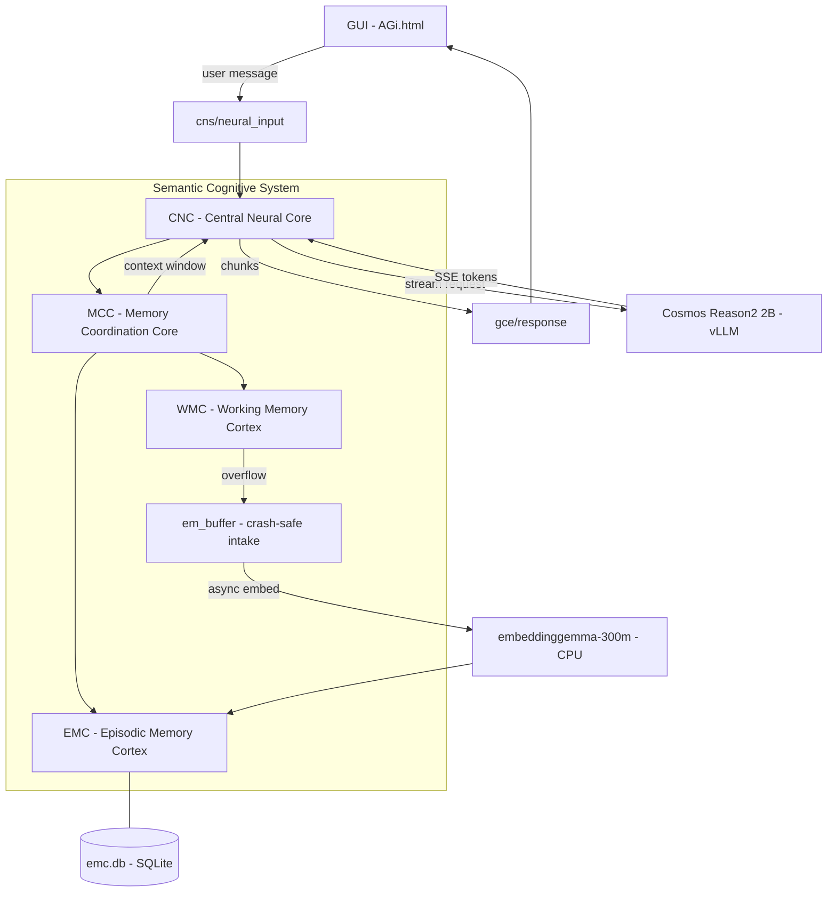
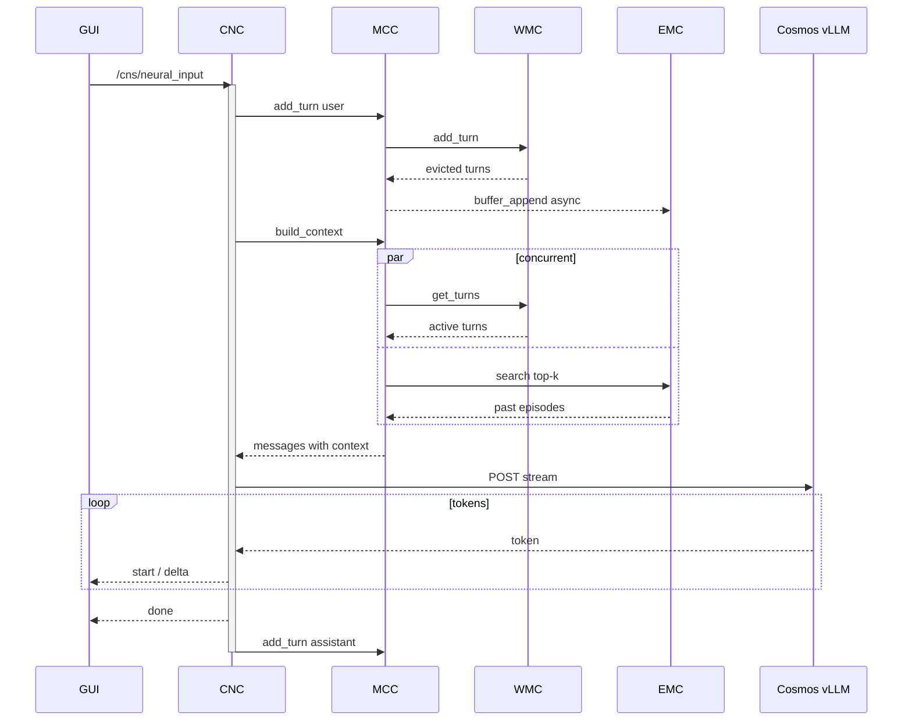

# AGi — Autonomous General Intelligence

**AuRoRA** · Autonomous Robot with Reasoning Architecture  
**Author:** [OppaAI](https://github.com/OppaAI) · Beautiful British Columbia, Canada

[](https://github.com/OppaAI/AGi)

[](https://opensource.org/licenses/GPL-3.0)


For more comprehensive documentation: [](https://deepwiki.com/OppaAI/AGi)

---

A clean-slate rebuild of my autonomous robot project, starting from first principles.
After building [ERIC](https://github.com/OppaAI/eric) for the NVIDIA Cosmos Cookoff 2026, I learned what I would do differently — proper ROS2 architecture from day one, a biologically-inspired memory system, and a foundation that can grow into full autonomy.

The goal: build an autonomous ground robot that can explore nature with me, powered by on-device AI with no cloud dependency.

---

## Hardware

| Component | Model |
|---|---|
| SBC | Jetson Orin Nano Super 8GB |
| Robot | Waveshare UGV Beast (tracked) |
| LiDAR | YDLIDAR D500 360 |
| Depth Camera | OAK-D Lite (stereo + YOLO) |
| Pan-tilt + Webcam | USB |
| Storage | 1TB NVMe |

---

## Stack

- **Cosmos Reason2 2B** via vLLM — vision + reasoning brain
- **ROS2 Humble** — full native architecture from day one
- **embeddinggemma-300m** — CPU-only semantic embeddings
- **SQLite** — lightweight on-device memory storage
- **rosbridge** — WebSocket bridge to web GUI

---

## Repository Structure

```
AGi/
├── AuRoRA/          # Robot workspace (Jetson Orin Nano)
│   └── src/
│       └── scs/     # Semantic Cognitive System
│           └── scs/
│               ├── cnc.py   # Central Neural Core (ROS2 node)
│               ├── mcc.py   # Memory Coordination Core
│               ├── wmc.py   # Working Memory Cortex
│               └── emc.py   # Episodic Memory Cortex
│
└── AIVA/            # Server workspace (PC) — future
    └── src/
```

---

## Roadmap

## Phase 1 — Chatbot with Memory
 
| Milestone | Description | Status |
|---|---|---|
| M1 | Chatbot + Working Memory (WMC) + Episodic Memory (EMC) | 🟢 In Progress |
| M2a | + Semantic Memory (SMC) + nightly reflection | ⬜ Planned |
| M2b | + Forgetting + conflict resolution | ⬜ Planned |
| M3 | + Procedural Memory (PMC) | ⬜ Planned |
 
### M1 — Chatbot + WMC + EMC
- PMT lifecycle with hybrid chunk/slot eviction (Miller's Law 7±2)
- Async embedding worker via embeddinggemma (evaluate performance at M2)
- Semantic search with cosine similarity
- SQLite WAL episodic storage — no expiry, 1TB NVMe
- Conflict/versioning columns in EMC schema (prep for M2b)
 
### M2a — SMC + Nightly Reflection
- Semantic Memory Cortex — distilled long-term facts
- 11pm Cosmos reflection pipeline — novel vs routine day detection
- Recursive summary update: Mi = LLM(Hi, Mi-1)
- Trivial PMT filter before EMC buffer
- Decision: keep async embedding or move to 11pm batch based on M1 data
 
### M2b — Forgetting + Conflict Resolution
- Ebbinghaus forgetting curve: R = e^(−t/S), S increments on recall
- Conflict detection during conversation — GRACE asks to clarify
- `_pending_conflict` flag in MCC for turn-spanning conflict state
- Memory versioning — `valid_from`, `valid_until`, `superseded_by`
- Dynamic WMC capacity via HRS reading VCS vitals
 
### M3 — Procedural Memory (PMC)
- YAML-based skill storage
- Skill ingestion pipeline
- Sandboxed skill execution
 
---
 
## Phase 2 — Voice
 
| Milestone | Description | Status |
|---|---|---|
| M4 | TTS on robot — Piper CPU streaming | ⬜ Planned |
| M5 | TTS in web GUI — browser audio playback | ⬜ Planned |
 
### M4 — TTS on Robot
- Piper CPU streaming on Jetson
 
### M5 — TTS in Web GUI
- Browser audio playback
 
---
 
## Phase 3 — Multimodal + Knowledge
 
| Milestone | Description | Status |
|---|---|---|
| M6 | Image input — camera + Cosmos vision | ⬜ Planned |
| M7 | ASR — on-device speech to text | ⬜ Planned |
| M8 | Knowledge ingestion — RAG + PDF/docs | ⬜ Planned |
| M9 | Agentic web search + crawling | ⬜ Planned |
| M10 | Messaging — Gmail, Slack, Telegram | ⬜ Planned |
 
### M6 — Image Input + Visuospatial Memory
- OAK-D frames → Cosmos Vision → text description → visuospatial PMT
- WMC visuospatial sketchpad slot (Cowan 4±1)
- Episodic buffer integrating phonological + visuospatial PMTs
 
### M7 — ASR
- Whisper on-device speech to text
 
### M8 — Knowledge Ingestion (RAG)
- Passive RAG — PDF/doc → embeddinggemma → SMC directly
- Conflict report UI for ingested knowledge
- Ingestion conflict resolution workflow
 
### M9 — Agentic Web Search
- AIVA LLM as web agent
- Active RAG — search → summarise → SMC
- Multiple search combining semantic + keyword + SQL
 
### M10 — Messaging
- Gmail, Slack, Telegram integration
 
---
 
## Phase 4 — Hardware + Autonomy
 
| Milestone | Description | Status |
|---|---|---|
| M11 | Motors + LiDAR + OAK-D integration | ⬜ Planned |
| M12 | Navigation + SLAM | ⬜ Planned |
| M13 | Agentic mission execution | ⬜ Planned |
 
### M11 — Motors + Sensors
- LiDAR → text description → visuospatial PMT
- OAK-D depth + object detection integration
- Sensor fusion into episodic buffer
 
### M12 — Navigation + SLAM
- Nav2 + Isaac ROS
- Spatial memory in SMC — home layout, familiar routes
 
### M13 — Agentic Mission Execution
- Mission planning via PMC skills
- Igniter node for ordered startup and health checks
 
---
 
## Phase 5 — Deep Learning
 
| Milestone | Description | Status |
|---|---|---|
| M14 | Graph-RAG — SMC as knowledge graph | ⬜ Planned |
| M15 | LoRA fine-tuning — permanent learning | ⬜ Planned |
| M16 | Test-time training — self-evolution | ⬜ Planned |
 
### M14 — Graph-RAG
- SMC as knowledge graph — entities + relationships
- Tree-based hierarchical search (HAT) for large SMC
- Multiple search strategies combined
 
### M15 — LoRA Fine-tuning
- Bake frequently accessed SMC knowledge into Cosmos weights
- GRACE learns permanently, not just retrieves
 
### M16 — Test-Time Training
- Adapt Cosmos weights during inference from new context
- Self-evolution milestone

---

## Architecture



---

## Conversation Sequence



---

## Quick Start

```bash
# 1. Clone
git clone https://github.com/OppaAI/AGi ~/AGi
cd ~/AGi/AuRoRA

# 2. Install deps
rosdep install --from-paths src --ignore-src -r -y
pip3 install -r requirements.txt --break-system-packages

# 3. Build
colcon build --packages-select scs
source install/setup.bash

# 4. Start Cosmos vLLM
bash launch/cosmos.sh
# Wait ~3 min for: Application startup complete

# 5. Start GRACE
ros2 run scs cnc

# 6. Start rosbridge
ros2 launch rosbridge_server rosbridge_websocket_launch.xml

# 7. Open GUI
python3 -m http.server 9413 --directory src/scs/scs
# Open: http://<jetson-ip>:9413/AGi.html
```

---

## Built by

Solo developer — Beautiful British Columbia, Canada. No CS/ML degree.  
Just curiosity, a tracked robot, and NVIDIA Cosmos Reason 2 on a Jetson.

Previous project: [ERIC — Edge Robotics Innovation by Cosmos](https://github.com/OppaAI/eric)  
Built for the NVIDIA Cosmos Cookoff 2026.
